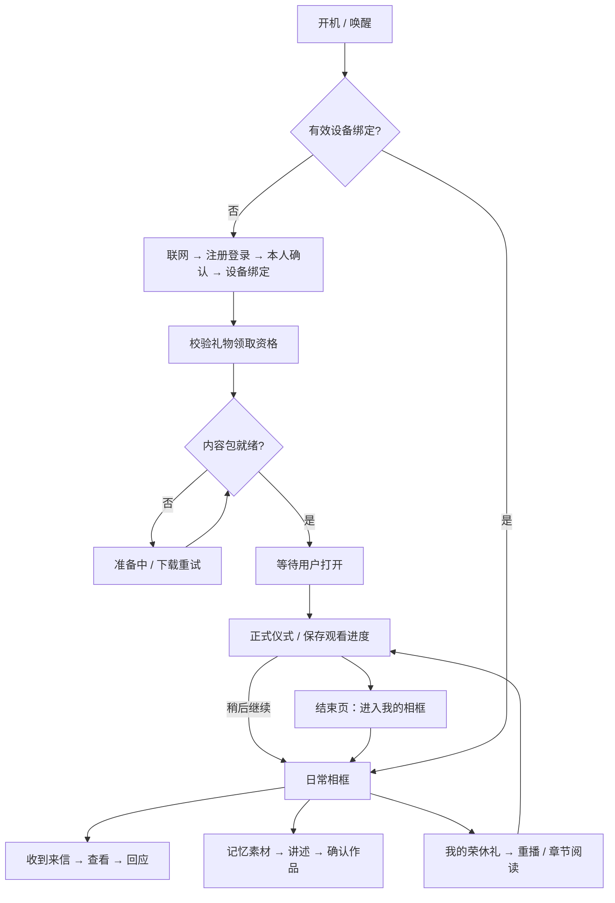

# 拾光叙相框完整产品 PRD

版本：V2.0 · 状态：开发评审稿 · 适用产品：以荣休礼交付为入口的拾光叙相框。

本文定义真实产品，不是展示网站说明书。覆盖注册登录、账号与设备绑定、礼物领取、仪式、日常使用及当前相框各功能页面。不将案例切换、角色体验、讲解备注、模拟验证码、固定人物和演示数据作为产品功能。

本文是相框端的新主文档，完整承接原相框专项中的排序、拼图、授权与离线规则。跨端共创和统筹流程仍分别见小程序及统筹 PRD；有冲突时，本文件关于相框入口、仪式与日常衔接、视觉的规则优先。当前代码核对与缺口单独放在《06_相框页面核对与开发差距清单》，不将原型已能点击误认为后台业务已完成。

## 1. 产品目标与核心体验

让长者收到一份由熟悉的人共同准备的荣休礼，完整观看属于自己的仪式；仪式结束后，同一台设备自然成为日常相框，继续接收近况、回应关心、讲述往事，形成持续增长的个人记忆资产。

核心链路：**开机联网 → 注册／登录 → 绑定本人和设备 → 领取礼物 → 准备播放 → 主动拆封 → 仪式 → 进入日常相框 → 收到与回应 → 继续积累记忆。**

用户不应在仪式后再次注册、不应切换到另一个人的家庭空间、不应重新上传刚看过的照片，也不应每次开机都被要求完整观看仪式。

成功标准：能完成首次领取；能稳定看完或稍后继续；日常能找到仪式原内容；能收到新内容并真实回应；记忆来源和权限不丢失。不能用播放动画完成率替代真实绑定或真实发送成功率。

## 2. 使用者、身份与权限

| 身份 | 能做什么 | 不自动获得什么 |
| --- | --- | --- |
| 受礼者／长者 | 领取本人的礼物、观看与回应、记录自己的生活、管理接收和设备 | 修改他人原稿、扩大他人素材授权 |
| 协助者 | 经长者确认，帮助联网、输入信息、绑定、调整设备 | 永久读取内容、接收所有提醒、成为受礼者 |
| 统筹者／主持人 | 管理自己获授权的项目、锁版、预下载、试播、现场正式播放 | 读取私人生活内容、替长者回应、永久管理礼后空间 |
| 共创者／送时光者 | 在小程序提交内容，收到允许的状态和长者回应 | 进入设备后台、读取其他人的私密材料 |
| 家庭空间成员 | 按明确授权访问家庭共享内容 | 因为是家人而读取全部荣休礼素材或健康资料 |

同一账号可有多种角色；服务端每次校验账号、设备、受礼者空间、项目与素材用途。参与者与长者的关系沿用“我是受礼者的什么人”，不反向解释。

**账号、受礼者档案、设备、礼物四者独立。**手机号属于登录账号；受礼者档案是内容归属；设备是播放终端；一位受礼者可以有多份礼物。礼后资产属于受礼者的授权空间，不属于原统筹者的私人账号。

## 3. 信息架构与页面编号

页面编号是研发和验收标识，不显示给最终用户。详情页和弹窗虽然可能没有独立 URL，仍需按独立状态实现。

| 模块 | 页面／状态 |
| --- | --- |
| A 首次使用 | A01 品牌欢迎；A02 联网；A03 登录方式；A04 微信扫码；A05 手机验证码；A06 身份确认；A07 设备确认；A08 礼物领取；A09 无礼物／待准备；A10 下载就绪 |
| C 仪式 | C01 待拆封；C02 开场；C03 人物印象；C04 照片；C05 故事；C06 集体信；C07 祝福；C08 收束；C09 单项详情；C10 暂停／离开／恢复 |
| H 日常首页 | H01 静默轮播；H02 菜单展开；H03 来信浮层；H04 礼物专题与重播 |
| R 关系与来信 | R01 家庭空间／互动历史；R02 人物筛选；R03 来信详情；R04 写回应；R05 家谱；R06 周报 |
| M 记忆资产 | M01 时光碎片；M02 筛选与搜索；M03 素材详情；M04 管理；M05 时光长河；M06 主题；M07 口述访谈；M08 故事阅读；M09 编辑；M10 亲友补充 |
| S 个人创作 | S01 个人书房；S02 相册；S03 上传／照片编辑；S04 留声机；S05 录音；S06 作品书架；S07 作品详情；S08 愿望；S09 私密保险箱；S10 未完成创作；S11 AI日记；S12 成稿 |
| X 小叙 | X01 聊天；X02 输入与附件；X03 整理预览；X04 角色切换 |
| E 扩展 | E01 探索专区；E02 银发广场；E03 关注；E04 同城；E05 活动详情；E06 专题；E07 健康首页；E08 用药；E09 健康记录；E10 小贴士；E11 打卡；E12 认知观察；E13 SOS |
| T 设置 | T01 账号与设备；T02 显示与播放；T03 网络与缓存；T04 隐私与接收；T05 声音与权限；T06 更新与帮助；T07 退出／解绑／重置 |

### 3.1 日常首页的入口组织

沿用当前相框的照片主视觉与展开式导航。底部主要入口为家庭空间、时光碎片、时光长河、银发广场，侧边有探索、设置与小叙。个人书房和健康模块从对应入口进入，避免首页堆满二十个模块。

荣休礼带来的学生、同事、下属、朋友等不是家谱成员。家庭空间的互动历史可以承载这些人的来信，但人物筛选需包含“全部／家人／其他关心我的人”；仅有亲属关系且被确认的成员才进家谱。将“家庭空间”改名为“亲友空间”可后续定案，不作为本版业务正确性的前提。

仪式专题在菜单展开时有稳定入口“我的荣休礼”，也能从作品书架进入；不能只靠一条会消失的通知找到。

### 3.2 范围与排期

完整页面均在本文定义。建议首交付必须完成 A、C、H、来信回应、记忆索引、小叙基础整理、T，构成可用闭环。家谱高级编辑、周报、创作增强、广场运营、健康服务等可分批实施，但不能以假成功或“已通知”等静态提示冒充上线能力。功能未接通时隐藏操作入口或明确不可用，不阻断收礼和日常看照片。

## 4. 主状态机：首次与再次启动

不把所有状态塞进一个 `step`。至少分开：账号会话、设备绑定、礼物领取、内容包、首次拆封、播放进度、日常空间授权。

| 当前状态 | 首屏 | 下一步与限制 |
| --- | --- | --- |
| 未联网、未绑定 | A01／A02 | 连接网络；不读出任何私人姓名或照片 |
| 已联网、未登录 | A03 | 注册／登录；扫码和手机号是两种入口 |
| 登录有效、设备未绑定 | A06／A07 | 确认本人或协助者与设备；不直接跳主页 |
| 已绑定、无可领取礼物 | A09 | 等待授权／输入领取凭证；可以使用已获许可的空白日常空间 |
| 已领取、包未就绪 | A10 | 下载并校验；不能展示已经收礼或观看完成 |
| 包就绪、尚未拆封 | C01 | 由用户点击打开；提供稍后打开 |
| 仪式中断、未结束 | 恢复提示 | 继续上次／从头开始／进入日常；不重复首次拆封通知 |
| 已进入日常、正常重启 | H01 | 直接回照片轮播；不自动重播仪式 |
| 再收到另一份礼物 | H03 新礼物入口 | 领取后可单独观看新仪式，旧资料不覆盖 |
| 会话过期但设备授权仍有效 | 按离线授权播放缓存 | 需要联网操作时重新认证，不持续弹窗打断照片 |
| 设备访问被撤销 | 锁定／重新绑定页 | 停止新下载、遮蔽私密内容；按撤销策略清理缓存 |

冷启动的详细判定依上表：已绑定但从未领取或从未拆封的用户不能因图中的简写直接绕过就绪检查。日常入口是允许用户跳过当下观看，不是绕过领取资格。

## 5. 注册、登录与首次设备绑定 A01—A07

### 5.1 A01 品牌欢迎与 A02 联网

未鉴权只显示拾光叙 Logo、简短使用介绍、登录／绑定入口和通用说明。不能出现某位长者头像、单位 Logo、他人祝福或固定案例。

网络页面显示可用网络、密码输入、连接中、成功和失败；支持显示／隐藏密码、重新选择网络。设备已联网则跳过。原生设备系统网络面板可复用，但返回产品后必须得到真实连接状态。无网不生成看似有效的在线二维码。

### 5.2 A03 登录方式

主入口微信扫一扫，次入口手机号验证码；扫码设备需显示二维码有效状态和可刷新入口，手机号表单按长者可操作字号排版。阅读并确认必要协议后才能继续。未注册手机号在验证并同意后创建账号，已有号码登录同一账号，不要求用户判断“注册还是登录”。

验证码发送间隔、有效期、错误次数由服务端返回，前端不固定假倒计时绕过。请求失败不进入下一页，不清空手机号；记录中不保存明文验证码。换号须验证，不能只修改显示手机号就改变账号归属。

### 5.3 A04 微信扫码确认

1. 设备创建短时绑定会话，二维码只包含不可猜测的会话标识和必要路由。
2. 手机登录小程序后显示设备名称／尾号和确认提示；扫码不等于已经绑定。
3. 手机选择“我本人使用”或“帮助长辈设置”。后者进入受礼者确认，不能把协助者账号自动设成受礼者。
4. 手机确认后，设备显示待确认的最小身份信息；必要时两端核对短码。
5. 服务端一次性消费会话并建立绑定；设备收到真实成功结果后继续。

二维码过期、被另一账号确认、设备已绑定、用户取消、手机断网分别呈现状态。刷新令旧码失效。重复回调返回已有结果，不能生成两台设备记录或多次领取。

### 5.4 A05 手机验证码

字段：手机号、验证码、获取验证码、协议确认、继续。支持数字键盘、粘贴验证码、修改号码、返回扫码。服务端验证号码控制权之后，还需验证领取资格；知道别人的姓名、生日或单位不能成为领取依据。

### 5.5 A06 使用者确认

显示将使用相框的受礼者姓名、称呼和必要头像；只展示账号已被允许查看的信息。本人确认／协助设置是此页的操作身份，不新建一套“礼物统筹角色”。协助者可录入受礼者最少资料，最终归属必须经过受礼者授权流程。无法本人确认的代理授权方式需另行定案，不默认无限代理。

### 5.6 A07 设备确认与权限

设备信息：友好名称、设备尾号、网络、账号掩码、绑定结果。设备只能有一个当前活跃受礼空间；多设备共享同一受礼者时独立管理权限。共享家庭设备的多用户切换作为独立增强，不在首版自动混播多人的私密礼物。

麦克风、摄像头在实际使用录音／拍摄时请求；拒绝仍能看照片与文字。不得把所有权限同意设为领取礼物的强制条件。亮度、字号可预设舒适档，后续可调整，不强迫逐项设置后才看礼物。

## 6. 领取与内容就绪 A08—A10

### 6.1 A08 可领取礼物

只列本账号／授权受礼者有资格的项目，显示礼物名称、送礼单位或发起者、准备状态、已领取状态。若仅有一份可进入确认页；多份需选择，不能取数组第一项自动打开。

领取凭证与普通共创邀请不同。普通共创码仅能参与，不能读取全部最终内容。领取凭证过期或失效提供联系交付方与重新验证，不提供任意姓名搜索领取。

### 6.2 A09 准备中／没有礼物

区分“没有领取资格”“礼物仍在整理”“已锁版但下载未完成”。用户可以重试或返回，不显示假进度。账号已有日常空间时可先进入日常；首次无任何素材时用品牌空态，不播放其他案例照片。

### 6.3 A10 下载就绪

显示真实已下载资源数／总数、必要时剩余体积、网络错误与重试。包至少包含章节、素材、顺序、布局、信件、音频、版权与授权引用、资源校验信息。

新包写临时区→逐项校验→整体标记可用→原子切换。未完成不得标“准备好了”。有旧可用版本时保留它；已撤销版本不作为回退。空间不足先说明可清理的非必要缓存，不自动删除用户唯一的未同步录音。

本版默认首次领取需要联网。离线签名交付包如需支持，须另有真实授权方案；不因存储卡里有文件就跳过绑定。

## 7. 拆封、正式仪式与试播

### 7.1 C01 待拆封页

在领取和校验成功后显示真实称谓、礼物封面和“打开这份礼物”；显示“稍后再看”。开场前允许调整音量、开启声音或静音，不自动大声播放。需要主持人操作时显示当前播放用途与版本，避免把私人版投到现场大屏。

### 7.2 三个独立事件

| 事件 | 成立时点 | 不包括 |
| --- | --- | --- |
| gift_opened | 已授权的正式开场成功显示，按项目首次幂等记录 | 扫码、登录、下载成功、统筹试播 |
| ceremony_started | 某次真实仪式会话开始 | 打开待拆封封面 |
| ceremony_completed | 本次有效章节播放到结尾，或用户明确结束本次观看 | 离开页面、下载完成、只看第一章 |

完成事件带 `completion_mode=played/ended_by_user`，不能把跳过仪式统计为完整看完。首次拆封通知由通知服务按分享权限发给参与者，相框不直接逐个调用消息渠道。重播、换设备或重复回调不重复首次通知。

### 7.3 统筹预览与正式观看

工作台试播采用 `playback_purpose=preview`，正式仪式为 `ceremony`，长者私人回看为 `private`。预览不能改变受礼者拆封状态。仪式包只包含允许公开现场展示的资源；私人相框内容可更丰富，但不能从公开包反向泄露。

### 7.4 C10 中断与恢复

保存项目、版本、章节、图组／故事／信页、音频进度和用户暂停状态。切章、关闭详情、离开播放器均停止不属于新页面的音频。每次位置变动持久化；不能只在浏览器关闭时保存。

退出时提供“稍后继续，进入相框”和“留在仪式”；已开始的播放位置保留。崩溃／断电后回到同一有效版本的恢复点；若版本已撤销，先重新校验，不跳进已不可见的内容。恢复以暂停状态呈现，不在用户没准备好时直接放声。

## 8. 仪式逐章规格 C02—C08

| 页 | 内容 | 主要操作 | 完整性规则 |
| --- | --- | --- | --- |
| C02 开场 | 真实称谓、封面、荣休主题、主办署名／Logo | 开始、声音、下一章 | 无封面用品牌版式，不生成假人像 |
| C03 大家眼中的你 | 印象标签、真实去重人数、获准关系信息 | 点标签看来源、上一／下一 | 不按职级给人加权，不公开联系方式 |
| C04 一起走过的照片 | 时间排序后的单图／拼图、作者、描述 | 暂停、组切换、点单图 | 按最终清单，不在设备重算顺序 |
| C05 有几句话想认真说 | 故事、作者、相关图／原声 | 读全文、上一／下一故事 | 长文可阅读到底；不只给被截断摘要 |
| C06 大家写给你的一封信 | 已确认正文、署名、标题 | 分页／滚动、朗读、字号 | AI信保留，不因链路导航隐藏而取消 |
| C07 这些心意都给你 | 多人祝福卡、录音、表情 | 展开、播放原声、换一批、全部 | 只有声音也形成有效卡；不漏掉普通贡献者 |
| C08 下一程 | 简短收束、获准署名、进入日常入口 | 进入我的相框、再看一遍 | 不再要求登录，不停留在死胡同 |

缺少某类内容时跳过空章，导航随有效章节变化。开场＋至少一种有效主体内容才能组成可交付仪式。未生成或未确认的集体信不能在设备自动编一封冒充已确认内容；其是否为锁版必需项沿用项目模板门禁。

### 8.1 C09 单项详情与返回

照片详情：原图、作者、时间精度、说明，支持缩放、上一张／下一张。故事详情：全文、来源、原声。祝福详情：全文、声音、作者；这里不自动发布回复。

打开详情暂停背景轮播，关闭回同一章同一项，不重置第一章。旋转屏幕或进入全屏只变布局，不重置播放。礼中展示不得让来信提醒盖住画面；可显示低干扰未读计数，完整通知等进入日常再处理。

### 8.2 动画与声音

以缓慢缩放和平移、淡入淡出为主，建议最大缩放约1.05、转场0.6—1秒；单图至少约8秒、拼图至少约12秒，最终按设备阅读测试调整。文字较多允许延长、暂停。减少动态模式使用静态画面。

全局仅一个声音焦点：用户原声、AI朗读、背景音乐不能同时竞争。用户原声播放时背景音乐暂停或降低；切章停止原声；收到新消息不抢当前声音。集体信朗读标明为系统朗读，不伪装任何参与者声音。

## 9. 仪式结束到日常：必须落地的连接规则

### 9.1 唯一明确出口

C08 的主按钮固定为“进入我的相框”；点击写入 `daily_entered_at`，关闭仪式音视频，进入当前受礼者 H01。不得打开新网站、切换账号、进入固定案例或显示研发选择菜单。路由跳转带稳定 `recipient_id` 与当前授权会话；不以姓名或 URL 中的案例名识别人。

首次过渡可显示一次轻量提示“照片和大家的心意都留在这里”，一键关闭。不强迫再次填写资料、不自动发回复、不强迫开始AI访谈。静默照片轮播从当前受礼者已获许可的素材开始。

### 9.2 内容落位映射

| 仪式来源 | 日常落位 | 不能发生的事 |
| --- | --- | --- |
| 整个冻结礼物 | 我的荣休礼专题／作品书架 | 只剩照片，整份仪式无法重播 |
| 照片及其文字 | 时光碎片与相册的引用记录 | 为每个入口复制一份独立源素材 |
| 故事 | 作品／故事阅读；可关联时光长河 | 自动改写为长者本人说过的话 |
| 集体信 | 礼物专题的独立信件入口 | 混进普通聊天、重新AI生成覆盖原信 |
| 祝福与录音 | 礼物专题和对应作者来信来源 | 把统筹者当全部祝福作者 |
| 标签／关系 | 礼物专题印象与关系索引 | 自动创建家谱亲属边 |
| 现场补充、礼后近况 | 新来信和日常资产 | 偷偷插入旧冻结版导致重播变样 |

落位使用稳定引用与可见性索引，保持源记录、修订与归属；消费同一个资产不能累计重复数量。多个礼物引用同一素材时保留多条来源关系，不合并不同人的作者署名。

### 9.3 日常重看

H04 显示礼物名称、交付日期、主办署名、版本、有效章节。可整场重播或直接读照片、故事、信与祝福。重播结束默认回到进入前的日常页面。新日常内容不会改变历史仪式，除非产生明确的新补充版并由用户选择。

## 10. 日常主页 H01—H03

### 10.1 静默轮播 H01

背景是已授权照片，保留原图比例；可用原图模糊延展。默认不显示大菜单、小叙或大段指引。不应让小叙头像常驻挡住照片。右上有低干扰来信入口与未读计数；不把收到通知自动当作已读。

点击空白进入 H02；左右滑动换照片，不同时误触展开。无照片显示自己的品牌空态与添加说明。照片加载失败跳过坏资源并可重试，保留其余资源。默认轮播10秒，可在设置改10秒／30秒／1分钟／5分钟／10分钟；该值属于日常，独立于仪式阅读时长。

### 10.2 菜单展开 H02

展示底部主入口、天气时钟、设置、我的荣休礼、探索和小叙。天气无真实数据时显示不可用，不保留固定天气；时间采用设备时区并校验。

空白再次点击收起；无操作约10秒可回静默。阅读来信、录音、输入、拖动、打开弹层时暂停自动收起。返回键先关闭最上层，再回主页，不一次退出产品。

小叙采用右侧扶边探身形象和轻微呼吸／挥手动画，只在菜单打开时出现；无菜单、来信或全屏内容遮挡期间隐藏。不得覆盖探索入口、播放控制、正文和关闭按钮；小屏腾出独立边缘区域或缩小，不用高 z-index 强压。问候气泡短句可关闭，不每次操作都重复朗读。

### 10.3 来信浮层 H03

显示发送者、关系、真实内容摘要、照片／音频标识。信封计数只计未读来信，不混入系统通知。打开信件可切下一封，关闭返回原照片与暂停状态。只有进入可见详情才记录阅读，收到、同步、加载封面都不等于已读。

礼物已准备、同步失败等系统消息与个人来信分开表达；礼中不自动弹出私人来信全文。

## 11. 来信、回应与关系页面 R01—R06

### 11.1 R01 互动历史与 R02 按人物查看

显示全部可见来信，按实际接收时间倒序；人物头像／署名／关系来自用户确认资料。筛选只影响当前列表，返回保持筛选与滚动位置。提供未读标识、文字／照片／原声摘要、详情入口。没有内容显示“还没有收到新的心意”，不补充别人的家庭数据。

来信可以来自家人、学生、同事等，不能硬称所有发送者为家人。通话／视频入口只有实际服务与对方授权可用时显示；按钮不能只弹“已联系”代替真实呼叫。

### 11.2 R03 来信详情

顶部显示发送者、关系、送出时间，正文支持1—3张近况图以及文字／声音。多收件发送在当前端只看到给自己的一份，不显示其他收件人的名单。点击图片看原图。来源若是荣休礼投稿，显示对应礼物与原稿来源，不误标为刚刚发来的新消息。

底部进入 R04 回应；显示此前自己真正送出的回应及失败待重试项。返回后未读计数及时更新，多设备同步不重复累计。

### 11.3 R04 回应编辑与发送

支持文字、语音、贴纸；主输入条单行起步，文字随输入增高。录音有开始、录制中、取消、停止、试听、重录、发送，不以沉默音频模拟真实录音。建议单条最长60秒；达到上限停止并进入试听，不自动发送。

选择贴纸先预览，点发送才真正提交。AI建议仅填入草稿，用户确认后发送；不能点“AI建议”就替用户发谢谢。离开保留未发送输入或明确询问，不能把尚未提交的内容显示成已回应。

发送状态：编辑→上传中→服务端已接收→已送达对方空间／失败可重试。请求使用幂等标识，连点不重复发。网络失败保留内容。回应只给原发送者／明确目标，不广播到整场共创，也不自动进入公开广场。

收到新近况后，原发送者可在小程序看到“已回应”和回应内容；服务号提醒需实际授权与渠道能力。已查看、已收藏、已回应是不同状态，不使用“被珍藏”替代真实回应。

### 11.4 R05 家谱与成员详情

支持平移、缩放、居中、全屏、点成员查看已授权信息。家庭关系必须显式确认；老师／学生等显示在关心我的人列表，不进入亲属树。涉及多个家庭的同名人物使用稳定人物ID。

查看与编辑权限分开；无权限隐藏编辑。未确认关系显示待确认，不根据照片人脸或AI推断血缘。空家谱允许稍后完善，不影响收礼。联系人电话按用途授权，不在大屏公开展示。

### 11.5 R06 周报

以实际可见的一周来信与长者回应生成摘要；每条可追溯回原内容。起止日期、统计去重口径明确；未收到不制造“大家都惦记你”的虚构数量。摘要可阅读／朗读，禁止将私人资料默认分享给全家。无内容时显示空态或不生成。

## 12. 时光碎片 M01—M04

M01 汇集照片、录音、文件、作品的统一索引，类型标签为全部／照片／录音／文件／作品。M02 可按时间、人物、地点、事件、合照、物件、主题筛选与搜索；不要求所有素材都有每个字段。

搜索输入支持文字和语音转写；转写后用户可改词，不把固定搜索词当语音识别。筛选有已选条件和清除；切类型保留兼容条件、不兼容条件显式清除。无结果有修改条件入口。数据多时分页或逐步加载，不能阻塞相框主页。

M03 按内容类型打开原图、真实音频、文件阅读或作品；均有作者、内容日期、来源、相关礼物／故事和权限范围。文件未支持预览时显示下载或手机查看，不白屏。

M04 管理支持当前筛选下多选、全选、移出轮播、移出分类及删除。移出展示不删除作者原稿；删除用户自己上传的源素材影响哪些作品应预先列出并确认。只有引用权限的素材只能移除本地展示／收藏，不能删除别人的源记录。删除确认、服务端失败恢复、同步提示必备；不能纯前端删卡即宣称删除成功。

时间规则：仪式重播按锁版顺序；日常收件箱按接收时间倒序；素材时间检索用确认的内容时间，未知归入时间未补充；新收录旧照片同时保留内容年代与收录日期。两种时间不能互相覆盖。

## 13. 时光长河、访谈与故事 M05—M10

### 13.1 M05 总览与 M06 主题

通过主题卡浏览童年、工作、家庭等真实已创建的阶段。主题名、年代和完成度来自当前受礼者资料，不能按固定人物年份生成。无年代可不显示。滑动切主题保留位置；主题内话题区分可开聊、进行中、已有作品，已完成数量来自有效作品，不能由点过卡片计算。

话题提供“开始聊”“继续聊”“查看故事”；自定义话题使用明确按钮。长者可跳过、不想回答、暂停；不强迫把每个生命阶段填满。荣休礼已有故事以投稿者视角保留，长者补充形成自己的版本或附记，不覆盖原作者。

### 13.2 M07 口述访谈

进入时显示主题、当前问题、麦克风状态、开始／暂停／结束、返回。状态至少包括待开始、倾听中、转写中、整理中、小叙回应、暂停、保存失败。单次只问一个问题，长者可以换个问法、跳过、先记到这、念给我听。

真实音频与转写分开存；转写错误可修订，不修改原音频。网络断开保留已录分段，提示稍后整理；不得用固定脚本假装正在听见用户。结束后展示已记录片段与整理预览，可以保存、继续或放弃本次未保存部分。离开时保留已提交内容，未保存部分有明确选择。

### 13.3 M08 故事阅读

展示标题、真实作者／讲述者、整理方式、正文、图片来源、原声、段落导航。可读给我听、暂停、调字号、进编辑、返回主题。读到哪里保存到哪里，关闭朗读不丢阅读位置。

图片区分上传原图与AI示意图，AI图必须标识且不作为历史事实证据。不能清除标识让生成照片看似原始记忆。跨作者或跨人物找不到源内容时显示不可用，不用默认故事顶替。

### 13.4 M09 编辑与AI整理

允许编辑本人作品的标题、段落和配图；支持段落修改、全文文风调整、口述改写、撤销／重做、保存和取消。AI输出先形成候选，显示调整前后，用户采用才写新修订。人名、年代、人物关系、关键事件有来源，缺失事实应提问或保留未知。

保存区分处理中、保存成功、失败重试；离开未保存有提示。全文改写不可悄悄覆盖人工修改的另一端版本；发生版本冲突提供保留本稿与重新载入。共享或已用于冻结礼物的作品产生新修订，不改写旧仪式快照。

### 13.5 M10 亲友补充与回应

亲友可以受邀补充相关照片／片段；分别保存作者和权限，长者决定是否纳入自己的作品。拒绝纳入不删除作者原始内容。故事下不默认开放共创者之间的公共评论流，延续“看见参与、加强长者回应”的原则。

现有正文／共创／评论分区在正式产品中调整为正文／亲友补充／给作者的回应；回应默认作者及长者可见。是否开放家庭群体讨论须另行立项，不能因原型有评论按钮就开启所有参与者互评。

## 14. 个人书房与创作 S01—S12

### 14.1 S01 书房与 S02 相册

书房汇集相册、留声机、作品、愿望与私密资料。相册与时光碎片引用同一素材，不维护两套重复库。相册可按最新收录、人物、地点、事件等查看；只有用户确认的标签可以作为事实。添加、编辑、查看原图、纳入轮播需有明确入口。

### 14.2 S03 上传与照片编辑

来源可为设备相册、拍摄或手机扫码上传；依硬件支持显示。上传每张有进度、失败重试、取消、可选描述和时间。旧照片翻拍时间不能当原始年代。照片顺序、日期与文字修改都保存修订。

AI生图与原图修复分开：生成结果为衍生文件并标记，不覆盖原图；使用人物照片生成需有用途授权。没有能力时不把示例图片写入用户相册。相册的“重点展示”如未来需要应与仪式排序解耦；荣休礼整理仍没有“设为重点”规则。

### 14.3 S04 留声机与 S05 录音

按时间、发送者、关联故事、待拆封分类。每条有标题、来源、真实时长、播放状态。选中一条暂停上一条，退出停止；支持录音、试听、命名、删除本人录音、关联故事。

待拆封是有授权和实际开放条件的音频，不是客户端隐藏按钮即可保护；条件未满足不下发可播放资源。无有效未来赠言业务时不展示此分类。

### 14.4 S06 作品书架与 S07 详情

只摆放本人的实际作品、获准共创成品和礼物专题。书封、题名、来源、最近修订、阅读进度均真实。选择→预览→打开阅读，支持朗读、继续编辑本人作品、明确对象分享。不得预置无版权的整书或其他人的故事充当本人作品。

荣休礼专题是只读冻结交付物，用户可以从中另建整理作品，但不能直接编辑统筹已交付的原版。分享前校验每项素材允许的对象和用途；分享链接可撤销、不可永久公开裸资源。

### 14.5 S08 愿望清单

我的／获准家人筛选，待完成／已完成两种列表。文字或语音新增愿望、编辑、标完成、撤销完成、删除。愿望默认私人；只有明确分享才对所选对象可见。代他人愿望标完成需要权限。无愿望显示可创建空态，不自动生成长者愿望。

### 14.6 S09 私密保险箱

二次验证前不显示内容标题、封面、数量以外的敏感信息；首版采用可实现的设备PIN或手机确认，人脸方案需硬件和安全设计确认后再开。取消／失败返回书房；短时自动上锁，退到主页即隐藏，不进入首页轮播、全局搜索摘要或家人周报。

私密资料不能因统筹角色或家庭成员身份自动可见。删除与授权变更须真实服务端生效；云端／离线限制明确。

### 14.7 S10 未完成创作与 S12 成稿

长者口述和编辑过程允许自动保存，入口叫“继续上次”或作品内状态；这不是重新增加小程序“我的礼物”草稿分类。保存对象是个人创作，不是尚未正式发起的礼物。

成稿页显示AI整理候选、原始来源、编辑、保存为作品、继续润色、选择对象分享。保存与分享分两步，保存成功不自动广播给家人。

### 14.8 S11 AI日记

当天话题可包括日常、心情、身体感受与随便聊，全部可跳过；报平安不要求完成三段访谈。日记私人保存，分享范围由本人选。显示真实日期、是否保存、连续记录等，不制造固定打卡记录。

“未打卡”不能自动等于危险或触发SOS。自动关怀如立项，需本人明确开启、联系人确认、时间规则、误报取消和真实通知链路；默认关闭，不依赖本地倒计时宣称已通知。

## 15. AI小叙 X01—X04

小叙的职责是帮助看内容、表达、整理和查找，不替用户确认事实、扩大授权或发送消息。

X01 聊天包含当前主题、消息、输入条、语音／键盘切换、返回。X02 支持按需录音和附件预览、取消、重试；上传完成不等于消息已发。X03 将整理结果展示为候选，用户可修改、采用、撤销。X04 切换角色前说明作用范围；角色切换不自动读取所有健康或私密资料。

会话状态：待输入、录音、转写、请求中、生成中、完成、失败、取消。网络失败保留输入，重试不重复创建消息；长回复支持停止与继续阅读。用户拒绝麦克风仍能键盘输入。朗读可独立关闭。

语音导航只操作明确意图；删除、分享、修改身份、发送消息需显示确认对象和内容。称谓来自受礼者档案，避免姓名和称呼机械重复。家人、学生、同事的原话不能让小叙说成自己亲身经历。

医生／中医／导游等扩展角色按能力开关开放。健康资料与普通回忆分区授权；健康角色不作为诊断或处方系统。导游中的天气和行程依真实来源与查询状态返回，不复制固定案例天气。上述角色不影响基本收礼闭环。

## 16. 探索、银发广场与活动 E01—E06

### 16.1 探索入口 E01

分组呈现已可用的生活服务、健康与个人工具。服务商、可用城市、价格和条件以实际数据为准。外部跳转说明将离开相框，能一键返回。未接入服务不显示下单或联系成功。隐私授权不可因点探索就扩大。

### 16.2 广场 E02／关注 E03

发现展示获公开许可的内容，可看详情、收藏、关注、发送贴纸；反应均以服务端结果为准。我的私密来信、荣休礼故事和AI信不自动进入广场。公开发布必须逐项检查素材用途；不允许从私人相框一键“全量公开”。

关注页可按作者筛选、取消关注，空列表引导发现。广场可有推荐主题，但不为增加社交噪音把所有来信推入公共流；共创筹备看板也不能变成广场评论区。公开内容具备举报、不感兴趣、拉黑和审核状态，具体运营上线条件另行评审。

### 16.3 同城 E04／活动详情 E05／专题 E06

同城默认用户选择城市；需要定位时单独请求。活动详情含主办方、地点、时间、费用、名额、参与条件、取消方式。报名确认后才提交，失败不显示已报名；重复点击幂等。活动状态变动需通知参与者，报名不默认公开长者全部资料。

专题是内容集合，点卡到正文；不能冒充荣休礼必经流程。商业购买、支付和线下履约不属于相框首收礼的前置条件。

## 17. 健康、关怀与SOS E07—E13

这些是现有界面覆盖的扩展模块，以下定义交互与数据边界，不构成医疗判断规则；专业内容、服务与上线条件需要专项方案。

| 页 | 正式产品要求 |
| --- | --- |
| E07 健康首页 | 只展示已接通服务与本人授权记录；无资料用空态，不能显示固定“正常”数值 |
| E08 用药提醒 | 计划来自用户／授权照护者确认的实际医嘱录入；显示名称、时间和记录状态；已服／跳过／稍后要明确点选，不自动推断 |
| E09 健康记录 | 身体数据、饮食、报告等分类；每项有时间、来源、单位与修订；手录、设备采集、OCR识别相区分，识别结果经确认入库 |
| E10 小贴士 | 来源、更新时间、阅读／朗读；无来源不呈现为个人健康结论 |
| E11 打卡 | 真实记录日历，时区一致；补记与当日记录可区分，不用点击页面自动打卡 |
| E12 认知观察 | 明确同意、数据来源、观察局限；不把普通聊天或缺席打卡直接诊断为疾病；没有成熟模型与审核不显示风险结论 |
| E13 SOS | 配置且验证联系人后可用；触发→可取消倒计时→提交→渠道确认／失败，位置需授权与真实定位 |

SOS“已通知”只指渠道确认投递，不等于已联系上、已查看或救援已到达。网络失败／联系人不可用必须说明，并提供真实可用的联系替代入口。不以定时器结束同时点亮“位置已告知、手机已通知”。取消后停止尚未提交请求；已发出的通知说明无法收回。

健康资料不进入普通照片轮播、家庭周报、礼物包或共创者提醒，除非逐项明确授权。统筹者默认不拥有健康权限。

## 18. 设置 T01—T07

| 设置页 | 项目与生效规则 |
| --- | --- |
| T01 账号与设备 | 受礼者、账号掩码、设备名、绑定设备列表、协助者授权；变更归属需再认证，不用编辑昵称替代换人 |
| T02 显示与播放 | 字号、亮度／系统入口、轮播间隔、适配／填充、减少动态、静默时段；立即预览并持久化，重启有效 |
| T03 网络与缓存 | 网络状态、最近成功同步、下载队列、可用空间、重试、缓存管理；未同步原创作不可被普通清缓存删除 |
| T04 隐私与接收 | 谁可发来新内容、按人暂停接收、关闭通知、重要日子可提醒范围、隐私锁；关闭通知不等于屏蔽接收 |
| T05 声音与权限 | 系统音量、朗读、麦克风与摄像头权限说明、录音测试；拒绝权限保留替代操作 |
| T06 更新与帮助 | 真实版本、检测结果、下载、安装时机、失败恢复、常见帮助；播放仪式时不强制重启 |
| T07 退出／解绑／重置 | 三种动作分别确认；退出账号不自动删除云端资产，解绑撤销设备访问，重置清理设备私有缓存与凭证 |

重要日子由受礼者设置是否允许相关参与者获得提醒；生日可只披露月日，不能把完整生日放进普通关系卡。一个用户被暂停接收只影响该接收关系，不删除过去有效的共创署名。

设备丢失可从手机端远程撤销。离线设备无法保证即刻抹除，联网先核验授权再同步；本机应提供隐私锁与缓存保护。退出账号后不能通过返回按钮看到上一人的私密页面。

## 19. 照片排序、拼图与跨端一致性

本节的保守时间分桶是开发默认建议，须以配置版本保存；改变配置必须生成新候选并确认，不能各端各自解释“接近时间”。

照片首先按确认的年代从早到晚排序，未知日期靠后。统筹者拖拽后的最终顺序优先；相框读取最终顺序，不再次按日期覆盖。日常照片轮播可另选策略，但不改变仪式快照。

时间字段分开保存年、月、日与精度（年／月／日／未知），不得给未知补出虚假的1月1日。排序可计算年初／月初边界，但界面仍只显示已知精度。同边界低精度在前，再按提交时间与稳定ID兜底。EXIF只有经确认可作为内容时间；扫描或翻拍的文件时间不能冒充照片年代。

自动合并条件同时满足：当前用途允许、最终顺序连续、同一投稿者账号、同一允许时间桶。这里的“4”指最多4张照片，不指4个人；四位作者各一张默认仍各自展示。不能用姓名、职级、同单位或照片里的人脸数量替代作者ID。

| 日期情况 | 合并规则 |
| --- | --- |
| 确认到日／月 | 同年月可同桶，跨月不自动合并 |
| 仅确认年份 | 同一年且都仅年精度可同桶，不与精确月日图混桶 |
| 未知时间 | 默认逐张展示，不把全部未知并为同一时期 |
| 手动穿插了另一作者 | 在插入处分段，不跨过中间项抓回同作者照片 |

连续段按最多4张拆分：1单图、2双拼、3一大两小、4四宫格、5=4+1、6=4+2、7=4+3、8=4+4、10=4+4+2。大小仅布局需要，不表示投稿者重要性。不能复制图片补满格子。

编排服务生成 `photo_groups`，包含成员ID、组内顺序、布局和规则版本；预览、仪式、相框读取同一结果。组级日期显示真实共同精度，每张原图保留自己的日期和说明。点击组内照片进入其单图详情，返回同组。

授权撤回、坏资源、作者更正日期使新候选重新编排，历史冻结快照不静默修改；若涉及不能继续展示的资源，按撤销策略禁用或生成合规版本，不能通过回滚恢复。

### 19.1 算法验收样本

| 输入 | 输出 |
| --- | --- |
| A同月连续4张 | 1组四图 |
| A、B、C、D各1张同月 | 4张单图 |
| A1、A2、B1、A3、A4同月 | A双图、B单图、A双图 |
| A同桶10张 | 4+4+2 |
| A年精度图、A该年精确日期图 | 分桶 |
| A月精度图、A同月日精度图 | 可合并，详情各保留原精度 |
| A月末与次月初 | 分桶 |
| A未知日期4张 | 4张单图 |
| 四图组移除第2张 | 新候选变三图，源记录保留 |
| 两人署名相同但账号不同 | 不合并为同作者 |
| 统筹拖拽改变顺序 | 按最终顺序重新检测连续段，不恢复默认 |
| 同组在不同屏幕比例 | 成员顺序与署名不变，只调整布局 |

## 20. 数据对象与接口契约

以下为业务契约，实际接口路径由研发约定；不能只靠浏览器本地存储或跨窗口消息作为正式身份验证。

| 对象 | 至少包含 |
| --- | --- |
| Account / Recipient | 登录身份、受礼者稳定ID、称呼、头像、本人／代理关系 |
| DeviceBinding | 设备ID、受礼空间ID、授权账号、权限、绑定／撤销时间 |
| BindingSession | 短期会话、状态、有效期、一次性消费标识 |
| GiftEntitlement | 项目、受礼者、领取资格、领取状态 |
| CeremonyVersion | 冻结版本、用途、模板、章节、素材修订、排序与拼图、授权引用 |
| Asset | 原作者、来源、媒体、真实时间及精度、修订、可见范围、撤销状态 |
| DailyReference | 空间、源资产ID、关联项目、日常分类；不重复制造源资产 |
| PlaybackSession | 用途、项目版本、设备、章／项／音频位置、暂停、完成类型 |
| IncomingMoment / Reply | 发件人、当前收件空间、内容与媒体、送出／送达／查看／回应事件 |
| Story / Revision | 讲述者、作者、原音频、转写、人工修订、AI候选、采用记录 |
| DevicePreferences | 轮播、字号、声音、隐私与静默；区分设备级与账号级 |

| 操作 | 输入关键项 | 成功结果 | 失败与幂等 |
| --- | --- | --- | --- |
| 创建／确认绑定会话 | 设备、会话、手机账号、本人确认 | 绑定ID与权限 | 过期、已消费、冲突各自处理 |
| 查询／领取礼物 | 受礼者、领取凭证、请求ID | 资格与版本引用 | 无资格不可返回私人详情 |
| 获取内容清单 | 项目版本、用途、设备权限 | 媒体清单与校验信息 | 权限撤销先返回撤销状态 |
| 提交拆封事件 | 项目、版本、实际时间、事件ID | 首次成立或已存在 | 跨设备仍项目级去重 |
| 保存播放进度 | 会话、章／项、位置、版本 | 已保存位置 | 重试不倒退到过期写入 |
| 同步日常内容 | 空间、游标、设备 | 增量、撤销项、新游标 | 不以本地时钟过滤丢记录 |
| 发送回应 | 原来信ID、受礼者、内容、媒体、请求ID | 回应ID及状态 | 离线草稿、失败重试、去重 |
| 保存作品修订 | 作品ID、基修订、变更内容 | 新修订ID | 冲突不静默覆盖 |
| 改接收／隐私 | 空间、对象、范围、操作者 | 生效版本 | 服务端校验操作者权限 |
| 解绑／重置 | 设备、再认证、动作 | 撤销结果与清理指令 | 重复调用返回同一终态 |

## 21. 跨端消息与同步

收集结束通知、正式拆封通知、重要日子提醒、长者回应是四种事件，各自有触发条件、权限、内容版本和去重键。不能用一个“新消息”状态代替。

长者相框收到新内容后，服务器已收、设备已同步、用户已查看、长者已回应分别记录。设备离线期间，手机可以显示内容已送出，但不能显示长者已看到。

礼后无需原统筹者继续审核每次问候；接收按受礼者与发送者当前关系和内容规则执行。多人发送逐个收件人独立成功或失败，不因一个人拒收就泄露其他人的名单。

同一资源在家谱、相册、碎片、故事与仪式中通过引用关联。源资源撤回后，所有可见性索引一致更新；不能某一页隐藏了，另一个播放器仍可直接打开。

## 22. 离线、错误与恢复

| 情况 | 页面表现与动作 |
| --- | --- |
| 首次绑定无网 | 连接网络；不假登录成功 |
| 旧有效包已下载 | 可离线看仪式与照片；必要处提示同步状态 |
| 资源损坏 | 单项重试，跳过允许跳过的项；核心包缺失不宣称就绪 |
| 仪式播放中来新版 | 后台下载校验，下次观看再切换，不突然换内容 |
| 新来信未下完图片 | 显示真实加载或失败；不以空白图片宣称已完整看过 |
| 录音上传失败 | 保留本地原录音和待发送状态；可重试／取消 |
| AI服务失败 | 保留输入与原始材料，能继续手动编辑 |
| 退出／断电 | 已提交内容与播放位置持久化；重进先核对版本与授权 |
| 离线撤回 | 不保证即时抹除；恢复联网先同步撤销清单 |
| 日期／时区异常 | 不写入错误正式日期，记录设备时间与服务端时间供校正 |
| 清缓存 | 可重下载的媒体与未同步原创作分开，后者不得静默清除 |

错误提示要说清哪一步失败、是否保存、下一步能做什么，避免统一“操作成功”或没有出口的错误弹窗。

## 23. 统一视觉、可读性与无障碍

采用日常相框的暖白、浅杏、深棕、真实照片背景与轻透明卡片。主色参考：背景 `#fbf3eb`，卡片 `#fffaf4`，正文 `#2f2a24`，主操作 `#72543d`，次操作 `#fbe8d5`。照片播放可用中性深色衬底，不恢复大片绿色仪式底。

字体为清晰无衬线中文字体；真实设备默认正文建议21—26px、主要标题32—46px、辅助文字不低于约18px，按物理尺寸和阅读距离验证。以上是设备设计基准，不直接套到手机。正文支持大字档，长文本完整可读。主要按钮建议触控区域至少约64×64px，关键操作不能只用无文字小图标。

文字覆盖照片必须有足够遮罩；开关既有文字状态也有视觉状态。焦点可见、返回位置明确、触摸之外保留键盘／遥控基础导航。减少动态关闭装饰性动作；音频可暂停，文字内容不依赖声音。小叙默认静默，菜单收起时隐藏。

## 24. 埋点与质量目标

记录真实的登录完成、绑定完成、领取、包校验、正式拆封、仪式开始／暂停／完成、进入日常、打开专题、新来信查看、回应提交／成功、作品保存和失败。事件有唯一ID、项目／空间、版本、用途、业务时间与接收时间，不记录验证码、完整健康原文或不必要的私人内容。

核心指标：绑定成功率与耗时、包准备成功率、仪式中断恢复成功率、进入日常比例、后续来信查看／回应率、有效原创作保存率。播放完整和用户主动跳过分开统计。

建议验收性能目标：已缓存主页在目标设备上快速恢复；照片切换无黑屏；列表采用分页／虚拟化；低内存设备不同时解码所有原图；音频切换不叠音。具体启动秒数、内存和离线容量需在明确硬件后给出测试阈值，不以桌面浏览器表现替代设备验收。

## 25. 端到端验收清单

| 编号 | 场景 | 必须结果 |
| --- | --- | --- |
| AC01 | 未登录设备开机 | 无私人信息，能走真实登录与绑定 |
| AC02 | 二维码过期／重复扫码 | 正确拒绝或返回已有结果，不重复绑定 |
| AC03 | 手机验证正确但无领取资格 | 不能看到他人礼物详情 |
| AC04 | 协助者帮长者设置 | 内容归长者，不自动归协助者 |
| AC05 | 包下载一半断网 | 显示未就绪，已有效旧包仍可用 |
| AC06 | 统筹试播 | 不产生正式拆封通知 |
| AC07 | 首次正式播放／多设备重复打开 | gift_opened只成立一次，播放会话可多个 |
| AC08 | 空类别 | 跳过空章，不插入假素材 |
| AC09 | 排序和拼图 | 第19节全部输入样本通过，三端顺序一致 |
| AC10 | 拼图点单图后返回 | 原组、原位置、暂停状态保留 |
| AC11 | 长故事与AI信 | 字号可读、全文可达，朗读与原声互斥 |
| AC12 | 祝福仅录音／较长文字 | 真实声音可听、全文可看，不显示空卡 |
| AC13 | 仪式中断／断电／旋转 | 位置保存，恢复暂停，不重复通知 |
| AC14 | 仪式结束点进入我的相框 | 同账号同受礼者，不重新登录，不跳错人物 |
| AC15 | 再次开机 | 直接日常，重播仪式入口仍存在 |
| AC16 | 日常收到新照片 | 不改旧冻结版，来源与作者可追溯 |
| AC17 | 菜单静默／展开／弹窗 | 小叙按条件出现，不遮挡操作 |
| AC18 | 原发送者收到回应 | 真实发送后才已回应；失败可重试，不重复 |
| AC19 | 学生／同事来信 | 可按人物查看，不被自动放进亲属家谱 |
| AC20 | 作品AI润色／撤销／修订冲突 | 原稿保留、用户采用后保存、冲突不覆盖 |
| AC21 | 私密保险箱未解锁 | 无内容泄露，不能进入搜索或轮播 |
| AC22 | 无健康与SOS服务 | 不显示假正常、假已通知或已联系 |
| AC23 | 关闭通知／暂停接收 | 语义分开，已有内容不被误删 |
| AC24 | 解绑／重置／退出 | 正确撤销和清理，返回键不能恢复私密页 |
| AC25 | 所有主体与详情页面 | 返回路径清楚；加载、空、失败、无权限均有出口 |
| AC26 | 私人素材尝试公开／现场投屏 | 按用途拒绝，不依赖前端隐藏按钮 |
| AC27 | 一人多礼物／多设备 | 不覆盖旧礼，不混人物，首次事件不重复 |
| AC28 | 设置轮播间隔后重启 | 真正持久化，仪式时长不受影响 |

## 26. 开发前需要定案的参数

| 项目 | 本文默认方案／需确认点 |
| --- | --- |
| 目标硬件 | 横屏触摸相框优先；具体屏幕、系统、摄像头／麦克风、存储和待机策略待硬件表 |
| 代理绑定 | 默认明确本人确认；无法本人完成的代理证明与权限期限需方案 |
| 收礼凭证 | 交付方如何发放、有效期、转赠／误绑撤销流程需后端及交付共同确定 |
| 自动拆封通知 | 默认首次正式开场成功成立；分享权限与通知渠道按真实授权 |
| 播放参数 | 单图8秒、拼图12秒为仪式建议；日常10秒可配置 |
| 时间分桶 | 采用第19节保守规则；如改跨月阈值须配置版本与验收样本 |
| 私密二次验证 | 默认PIN／手机确认，人脸不能仅依据原型图标上线 |
| 家庭空间名称 | 现名可保留，业务上须包含非亲属来信且与家谱隔离 |
| 扩展功能排期 | 所有页面已定义；广场、健康、商业服务的真实能力与运营条件独立确认 |
| 数据保留与离线授权 | 未同步录音、缓存、撤销清理、设备离线许可时长需容量和权限方案 |

上述待定项应配置化或隔离成独立能力，不阻止先实现确定的登录—仪式—日常骨架。不得把待定能力用固定案例和假成功文案替代上线。
